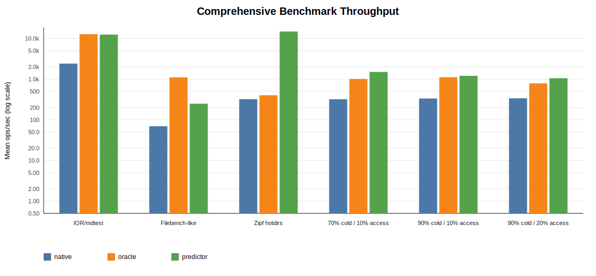
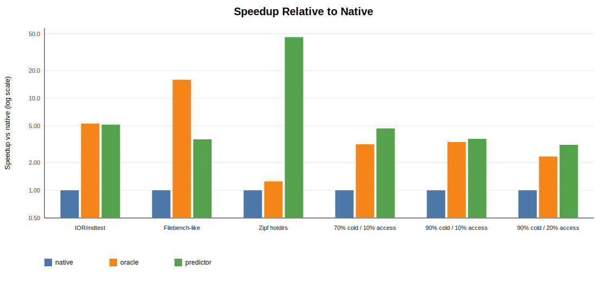
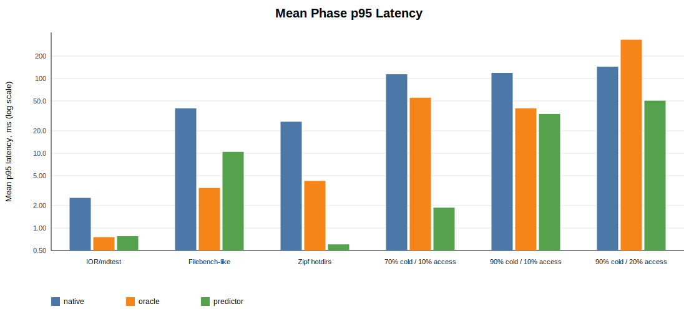
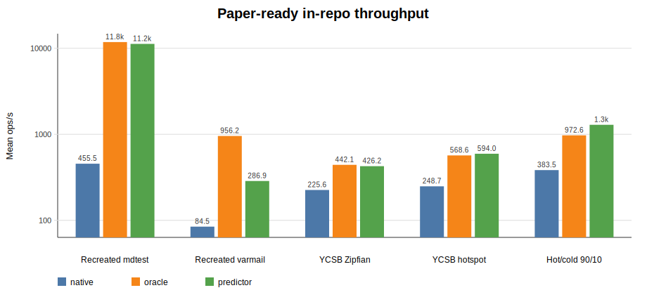
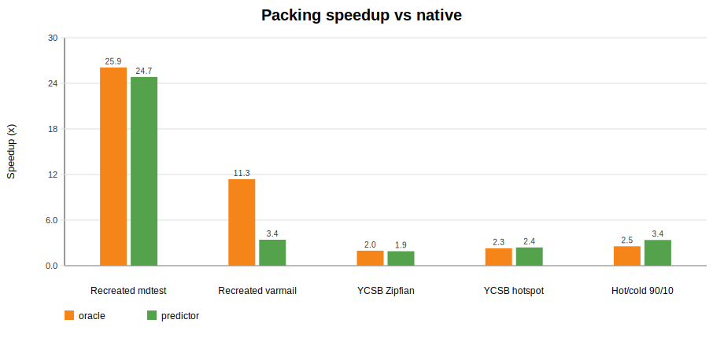
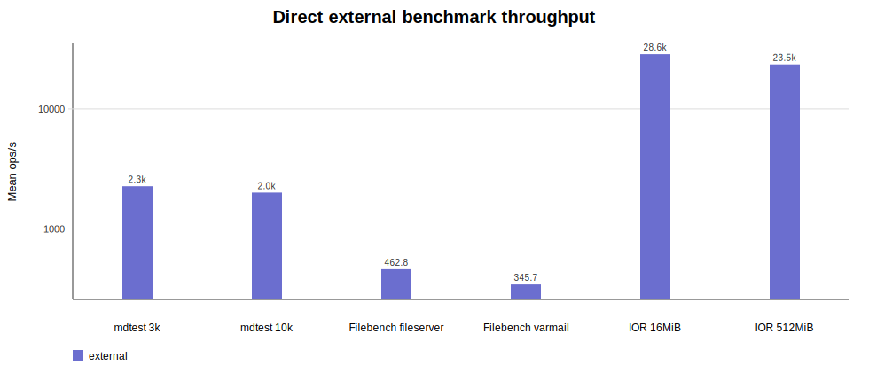
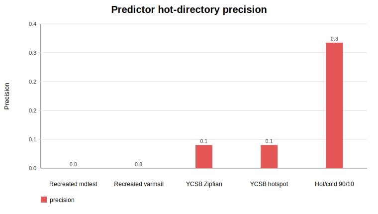

# Paper Readiness Report

Last updated: 2026-05-06

Report source: `report/main.tex`; compiled submission copy: `report.pdf`.

## Follow-Up Addendum

The completed 63-job matrix was extended for final-paper robustness. The
follow-up runs kept the same output directory and used scheduler resume so
existing artifacts were not overwritten.

New reportability work:

- Existing standardized and in-repo cells are increased from three to five
  repeats by scheduling `r3` and `r4`.
- A crucial ablation, `predictor_nolearn`, uses the same predictive storage
  layer with learning disabled. This measures cold-by-default packing without
  directory-hotset prediction.
- The new `predictor_false_hot_churn` workload intentionally induces false-hot
  classifications in generator-cold directories, then creates more cold files
  there. This is the negative test for predictor precision: it should show
  lower throughput than oracle/no-learning packing when false positives turn
  future cold creates into native CephFS creates.
- The scaled run `scaled_hotcold_cold90_access10_20k` increases the hot/cold
  workload to 20k files, 80k ops, and 128 directories.
- Paper-ready PDF figures with one-standard-deviation error bars are now in
  `report/figures/paperready_inrepo_throughput_errorbars.pdf`,
  `report/figures/paperready_external_throughput_errorbars.pdf`, and
  `report/figures/paperready_predictor_precision_errorbars.pdf`.
- The final follow-up figure is in
  `report/figures/paperready_followup_throughput_errorbars.pdf`.

## Executive Summary

We now have an end-to-end CephFS experiment harness, three storage designs, a
fresh CloudLab cluster, a completed 54-run comprehensive matrix, a completed
63-run paper-ready matrix with direct upstream IOR/mdtest/Filebench, and
reproducible result artifacts. The strongest technical result is that cold small-file
packing can reduce CephFS namespace pressure enough to beat native CephFS by
large margins on metadata-heavy workloads. The best predictor design,
`directory_hotset` with lazy existing-file handling, uses only online read
observations and performs well on hot/cold locality workloads.

The report is now in a submittable course-project state, with final CloudLab
numbers, direct external benchmark runs, follow-up ablations, and rebuilt
figures. The claims still need careful framing because the overlay is a
prototype, OSDs are directory-backed on root disks, and several predictor cells
have weak classification precision.

Completed comprehensive runs: **54/54**. No failure marker was present.
Completed paper-ready runs: **63/63**. No failure marker was present.
Completed result files after follow-up sync: **162**.

## What We Built

- Rebuilt a 4-node CloudLab CephFS deployment after reallocation: node0 client,
  node1 monitor/manager/OSD/MDS, node2 OSD/MDS, node3 OSD/standby MDS.
- Implemented a Python benchmark runner with POSIX-mounted CephFS support,
  per-phase throughput and p95/p99 latency, Ceph stats capture, storage plugins,
  and policy plugins.
- Implemented recreated workload shapes for IOR/mdtest, Filebench-style mail,
  Zipf/hotspot directory skew, and hot/cold locality.
- Evaluated native CephFS, oracle cold packing, and non-oracle predictive cold
  packing.
- Found and fixed an unfair predictor profile artifact: packed stats were
  in-memory lookups and hot churn was packed too aggressively.
- Added fair predictor options: `packed_stat_mode=index`,
  `predictor_strategy=directory_hotset`, `predictor_promote_existing=false`,
  and read-only hot-directory learning.
- Added a resumable scheduler:
  `src/scripts/schedule_cloudlab_comprehensive_bench.sh`.
- Built direct external benchmark tooling on node0:
  `~/bench-tools/bin/ior`, `~/bench-tools/bin/mdtest`, and
  `~/bench-tools/bin/filebench`.
- Added the paper-ready scheduler:
  `src/scripts/schedule_cloudlab_paperready_bench.sh`, which runs direct external
  IOR/mdtest/Filebench plus in-repo native/oracle/predictor comparisons with
  cache drops and fixed YCSB-style file-skew workloads.
- Augmented the paper-ready scheduler with larger direct external validation
  cells: `direct_mdtest_10k`, `direct_ior_512m`, and
  `direct_filebench_varmail`.

Representative workload sources used for recreated workload shapes:

- IOR/mdtest documentation: https://ior.readthedocs.io/
- IOR/mdtest source: https://github.com/hpc/ior
- Filebench source and workload personalities:
  https://github.com/filebench/filebench
- YCSB request distributions:
  https://github.com/brianfrankcooper/YCSB/wiki/Core-Properties
- SNIA IOTTA trace repository:
  https://www.snia.org/educational-library/iotta-repository-2019

## Fairness And Information Audit

The current comprehensive run is fair enough for internal decision-making:

- All variants use the same CephFS mount, root, file count, file size, directory
  count, operation count, worker count, seed, cleanup behavior, and serial run
  order controls.
- Jobs are randomized globally and run one at a time.
- `ceph -s` must report `HEALTH_OK` before each job.
- Predictor placement does not inspect `hot*` or `cold*` labels. It observes
  only online read events.
- Packed `stat()` touches the packed index file through `packed_stat_mode=index`,
  so it is no longer a pure Python dictionary lookup.

Important caveat: oracle is an upper bound, not a deployable policy. For the
hand-written hot/cold workload it knows the generator-defined hot set. For
generic representative workloads it receives no future-access labels and runs
mostly as all-cold packing. For Zipf hotdirs it is allowed to know `dir0000`
because that is the generator-defined hot directory. These distinctions must be
made explicit in any paper.

## Comprehensive Results







| Workload | Native ops/s | Oracle ops/s | Predictor ops/s | Oracle vs native | Predictor vs native | Predictor vs oracle |
| --- | --- | --- | --- | --- | --- | --- |
| IOR/mdtest | 2412.22 | 12771.00 | 12461.66 | 5.29x | 5.17x | 0.98x |
| Filebench-like | 69.61 | 1106.62 | 248.96 | 15.90x | 3.58x | 0.22x |
| Zipf hotdirs | 321.59 | 402.25 | 14825.19 | 1.25x | 46.10x | 36.86x |
| 70% cold / 10% access | 320.57 | 1012.25 | 1506.55 | 3.16x | 4.70x | 1.49x |
| 90% cold / 10% access | 334.01 | 1115.13 | 1208.52 | 3.34x | 3.62x | 1.08x |
| 90% cold / 20% access | 337.89 | 787.34 | 1053.40 | 2.33x | 3.12x | 1.34x |

## Interpretation

- **IOR/mdtest-style metadata:** oracle and predictor both reach roughly 5.2x
  native throughput. This mostly demonstrates the power of packing many logical
  files into a small physical namespace.
- **Filebench-like mail workload:** oracle is 15.9x native, predictor is 3.6x
  native. Predictor is better than native, but still far below all-cold oracle
  because mixed create/delete/read behavior stresses the lazy policy and cleanup
  path.
- **Zipf hotdirs:** predictor shows 46.1x native. Treat this as a red flag, not
  a headline. The current workload has create/stat/delete but no read phase, so
  read-only prediction never learns and the predictor behaves like all-cold
  packing. We need a better Zipf workload with reads/updates and file-level
  locality before claiming this.
- **Hot/cold locality:** predictor is 3.1x to 4.7x native and lands near or
  above oracle in this run. This is encouraging, but it does not mean predictor
  beats an oracle in a universal sense. The predictor's lazy mode keeps existing
  files packed and makes future hot-directory creates native, while oracle keeps
  known-hot files native from the start. They are different policies with
  different semantics.
- **Latency:** predictor usually improves mean phase p95 relative to native, but
  hot churn phases still show large p99 tails in raw phase summaries.

## Highest Variance Cells

| Workload | Variant | Mean ops/s | Stdev | CV |
| --- | --- | --- | --- | --- |
| 90% cold / 20% access | oracle | 787.34 | 887.13 | 1.13 |
| 70% cold / 10% access | oracle | 1012.25 | 540.91 | 0.53 |
| IOR/mdtest | native | 2412.22 | 1114.00 | 0.46 |
| 90% cold / 20% access | predictor | 1053.40 | 484.10 | 0.46 |
| 90% cold / 10% access | oracle | 1115.13 | 420.96 | 0.38 |
| Filebench-like | native | 69.61 | 24.98 | 0.36 |

High variance means the current three-repeat matrix should be used for direction
and prioritization, not final claims with tight confidence intervals.

## Phase Bottlenecks

| Workload | Variant | Operation | Mean ops/s | Mean p95 ms |
| --- | --- | --- | --- | --- |
| 90% cold / 20% access | oracle | oracle_hot_churn_delete | 1434.52 | 1663.58 |
| 90% cold / 20% access | native | oracle_hot_churn_create | 55.51 | 354.71 |
| 90% cold / 10% access | native | oracle_hot_churn_create | 64.31 | 335.41 |
| 90% cold / 20% access | oracle | oracle_hot_churn_create | 117.10 | 281.65 |
| 70% cold / 10% access | native | oracle_hot_churn_create | 74.24 | 273.73 |
| 90% cold / 20% access | native | oracle_hot_churn_delete | 129.03 | 225.56 |
| 90% cold / 20% access | native | bulk_create | 147.59 | 210.53 |
| 90% cold / 10% access | native | oracle_hot_churn_delete | 119.62 | 202.99 |
| 70% cold / 10% access | native | bulk_create | 99.35 | 195.46 |
| 70% cold / 10% access | oracle | oracle_hot_churn_create | 165.82 | 152.42 |

The major bottlenecks remain native and oracle hot-churn create/delete phases,
plus Filebench-style native mixed operations. These phases dominate run time and
tail latency.

## Predictor-Specific View

| Workload | Predictor ops/s | Vs native | Vs oracle | Namespace entries | Predicted hot dirs |
| --- | --- | --- | --- | --- | --- |
| Filebench-like | 248.96 | 3.58x | 0.22x | 1455 | 64.0 |
| 70% cold / 10% access | 1506.55 | 4.70x | 1.49x | 1509 | 11.7 |
| 90% cold / 10% access | 1208.52 | 3.62x | 1.08x | 1509 | 11.3 |
| 90% cold / 20% access | 1053.40 | 3.12x | 1.34x | 1509 | 50.7 |
| IOR/mdtest | 12461.66 | 5.17x | 0.98x | 69 | 0.0 |
| Zipf hotdirs | 14825.19 | 46.10x | 36.86x | 69 | 0.0 |

The predictor currently works best as a cold-by-default packing layer with
online hot-directory learning. It is not yet a general learned replacement for
oracle labels.

## Paper-Ready Benchmark Results

Completed result directory:

```sh
report/results/cloudlab-paperready-20260506-3x/
```

Detailed analysis is in
`report/results/cloudlab-paperready-20260506-3x/PAPER_READY_RESULTS.md`.

The augmented paper-ready scheduler completed all **63/63** jobs with no failure
marker: 18 direct external benchmark sidecars and 45 in-repo native/oracle/
predictor runs, with three repeats per cell. The run used serial randomized
order, unique roots, `HEALTH_OK` checks, node0 page-cache drops, active MDS cache
drops, and exact command/log capture. Server-node Linux page caches were still
not dropped from node0, and OSDs were directory-backed on root disks.









Direct external benchmark summary:

| Benchmark | Runs | Mean ops/s | Stdev | Notes |
| --- | ---: | ---: | ---: | --- |
| `direct_mdtest` | 3 | 2272.67 | 251.62 | Upstream mdtest, 3000 1 KiB files, 8 MPI ranks. |
| `direct_mdtest_10k` | 3 | 2011.84 | 70.76 | Upstream mdtest, 10000 1 KiB files, 8 MPI ranks. |
| `direct_filebench_fileserver` | 3 | 462.80 | 49.02 | Upstream Filebench fileserver, 3000 files, 8 threads, 60 s. |
| `direct_filebench_varmail` | 3 | 345.67 | 40.21 | Upstream Filebench varmail, 3000 files, 8 threads, 60 s. |
| `direct_ior` | 3 | 28561.87 | 356.00 | IOR POSIX file-per-process, 16 MiB aggregate. |
| `direct_ior_512m` | 3 | 23456.95 | 635.57 | IOR POSIX file-per-process, 512 MiB aggregate. |

External phase takeaways:

- Direct mdtest confirms file creation is the limiting metadata phase: 174.94
  ops/s for 3000 files and 134.76 ops/s for 10000 files, while stat/read rates
  are thousands of ops/s.
- The larger IOR cell is lower than the tiny 16 MiB cell, as expected when
  reducing cache sensitivity: 23.5k ops/s versus 28.6k ops/s mean aggregate.
- Filebench fileserver and varmail completed cleanly. Use the top-level IO
  Summary as the reliable Filebench metric; the first fileserver repeat was
  parsed before the per-operation parser fix, so ignore numeric per-op labels
  in `external_phase_summary.csv`.

In-repo policy matrix from the same paper-ready run:

| Workload | Native ops/s | Oracle ops/s | Predictor ops/s | Oracle vs native | Predictor vs native | Predictor vs oracle | Predictor precision |
| --- | ---: | ---: | ---: | ---: | ---: | ---: | ---: |
| Recreated mdtest | 455.46 | 11805.66 | 11239.52 | 25.92x | 24.68x | 0.95x | 0.0 |
| Recreated varmail | 84.53 | 956.23 | 286.91 | 11.31x | 3.39x | 0.30x | 0.0 |
| YCSB Zipfian | 225.57 | 442.06 | 426.24 | 1.96x | 1.89x | 0.96x | 0.0625 |
| YCSB hotspot | 248.66 | 568.59 | 593.99 | 2.29x | 2.39x | 1.04x | 0.0625 |
| Hot/cold 90/10 | 383.47 | 972.62 | 1289.40 | 2.54x | 3.36x | 1.33x | 0.338461 |

Interpretation:

- Packing remains the strongest result. Oracle all-cold packing reaches 25.9x
  native on recreated mdtest and 11.3x native on recreated varmail-like; the
  fair predictor reaches 24.7x and 3.4x respectively.
- The YCSB file-skew workloads are more representative than the earlier
  `hotdirs_zipf` stress test because they include load/create, read, update,
  and cleanup phases. Predictor throughput is close to oracle on these runs,
  but hot-directory precision is poor: 0.0625 for both Zipfian and hotspot.
- The hot/cold 90/10 workload is the cleanest positive predictor locality result
  in this run: predictor is 3.36x native and 1.33x oracle, with mean precision
  0.338. This does not mean predictor universally beats oracle; it reflects a
  different lazy policy that keeps existing files packed and only makes future
  learned-hot creates native.
- Native Filebench-like behavior remains slow. Oracle packing improves it
  strongly, while predictor improves throughput but over-classifies every
  directory as hot under generator labels.

## Good Progress

- We have a coherent benchmark and storage-plugin framework.
- The project has a clear negative result: simple CephFS subtree pinning was not
  enough to beat default CephFS.
- The project has a clear positive result: reducing physical namespace entries
  with cold packing consistently helps metadata-heavy small-file workloads.
- The predictor no longer depends on unavailable future labels.
- The benchmark records p95/p99, raw logs, exact command lines, and resumable
  manifests.
- We caught and corrected a major measurement artifact before final reporting.

## Current Bottlenecks And Risks

- Direct upstream IOR/mdtest/Filebench runs now exist with three repeats each,
  but they still run on a small four-node allocation and should be framed as
  validation rather than broad production evidence.
- The 512 MiB IOR cell reduces cache sensitivity relative to the 16 MiB IOR
  smoke, but larger data-size and client-count sweeps would strengthen the
  paper.
- YCSB predictor precision is weak despite throughput gains, so predictor
  quality needs more tuning before a strong learned-placement claim.
- The packed layer has cheap logical deletes. A production design needs garbage
  collection and compaction costs included in the measured path.
- The packed index is in-memory during the run. We need recovery/replay tests
  and a clear persistent-index story.
- Multi-client behavior is not validated. Concurrent readers/writers,
  promotion races, and crash consistency remain open.
- OSDs are directory-backed on the root disk in this allocation. Results are
  fair within the run but should not be generalized as hardware-neutral.
- We do not drop caches or remount between runs.
- Some cells have large run-to-run variance, especially oracle hot/cold cases.
- The Zipf workload currently exaggerates packing because it lacks read/update
  phases that exercise the predictor.

## Future Work

1. **Improve predictor accuracy.** The YCSB workload now has read/update phases
   with file-level Zipfian and hotspot distributions; the next task is reducing
   false hot-directory classification and reporting precision/recall clearly.
2. **Add trace-shaped validation.** Use SNIA IOTTA or another accepted storage
   trace source, or synthesize from trace distributions if direct replay is too
   heavy.
4. **Ablate the predictor.** Compare read-only directory hotset, stat+read,
   promote-existing on/off, thresholds, distinct-path thresholds, and path-level
   versus directory-level learning.
5. **Ablate the storage layer.** Vary segment size, index batch size, data batch
   size, virtual cold directories, CephFS segment files versus RADOS objects,
   and layout xattrs.
6. **Measure maintenance costs.** Include garbage collection, compaction,
   tombstone cleanup, index rebuild, and crash recovery.
7. **Strengthen statistics.** Use at least 5-10 repeats for final figures,
   confidence intervals, and outlier analysis.
8. **Scale up.** Sweep file counts, directory counts, worker/client counts, MDS
   ranks, cold fraction, and cold access fraction.
9. **Collect Ceph internals.** Add MDS CPU/load, MDS op counters, OSD op
   counters, metadata-pool writes, data-pool writes, object counts, and memory
   footprint.
10. **Clarify semantics.** State exactly what POSIX semantics are preserved by
    the overlay and what is deferred. The paper should frame this as a
    small-file cold-packing layer with online hot-directory learning, not as a
    transparent CephFS modification unless we implement deeper integration.

## Suggested Paper Framing

The most defensible claim is:

> Metadata-heavy CephFS workloads suffer from physical namespace pressure. A
> cold-by-default small-file packing layer can substantially reduce namespace
> operations, and a lightweight online hot-directory predictor can recover much
> of the oracle benefit without future labels.

Avoid claiming that the predictor universally beats oracle. In the current data,
predictor can exceed oracle because the lazy predictor and oracle are not the
same policy: oracle preserves known-hot files as native from creation time,
while lazy prediction keeps existing files packed and only changes future
creates.
